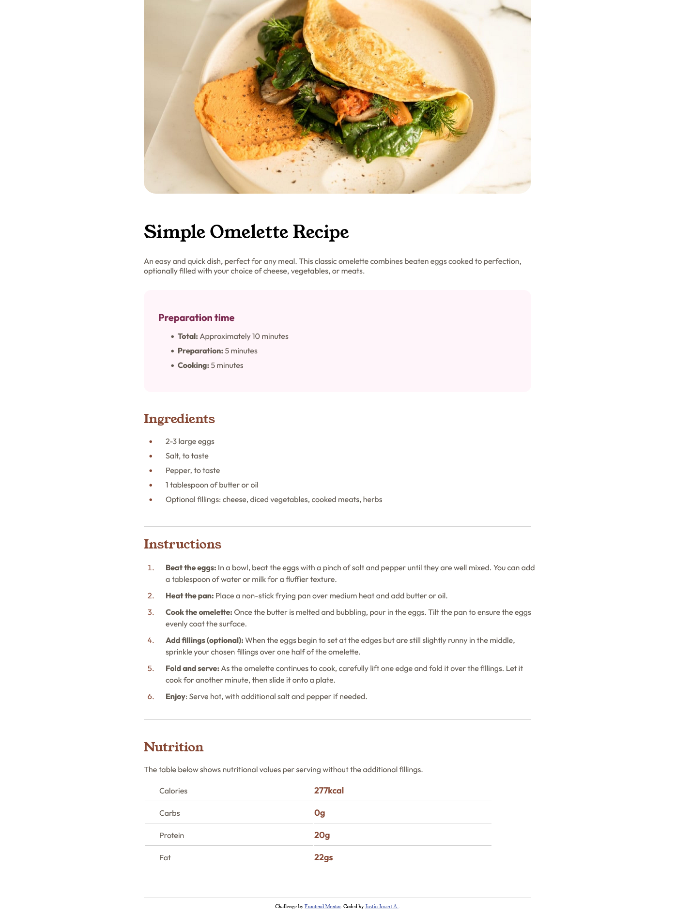

# Frontend Mentor - Recipe page solution

This is a solution to the [Recipe page challenge on Frontend Mentor](https://www.frontendmentor.io/challenges/recipe-page-KiTsR8QQKm). Frontend Mentor challenges help you improve your coding skills by building realistic projects. 

## Table of contents

- [Overview](#overview)
  - [Screenshot](#screenshot)
  - [Links](#links)
- [My process](#my-process)
  - [Built with](#built-with)
  - [Continued development](#continued-development)
  - [Useful resources](#useful-resources)
- [Author](#author)
- [Acknowledgments](#acknowledgments)

## Overview
A Recipe Page challenge from Frontend Mentor to solidify my skills. 

### Screenshot

### Links

- Live Site URL: [Github](https://justinjovert.github.io/Frontend-Mentor-Recipe-Page-using-Flexbox/)

## My process
 Built a container for the whole text semantic. A separate container for image because I think padding is not needed when on a smaller screen size.
 
 Used unordered lists and ordered lists semantics depending on the content, and adjust list properties accordingly. 

### Built with

- Semantic HTML5 markup
- CSS custom properties
- Flexbox

### Continued development

Continue to do challenges to solidify skills.

### Useful resources

- [Asaeneh's 30 Day of JavaScript](https://github.com/Asabeneh/30-Days-Of-JavaScript)

## Author

- [Github](https://github.com/Justinjovert/)
- Frontend Mentor - [Justinjovert](https://www.frontendmentor.io/profile/Justinjovert)

## Acknowledgments

Frontend Mentor and Asabeneh Yetayeh.